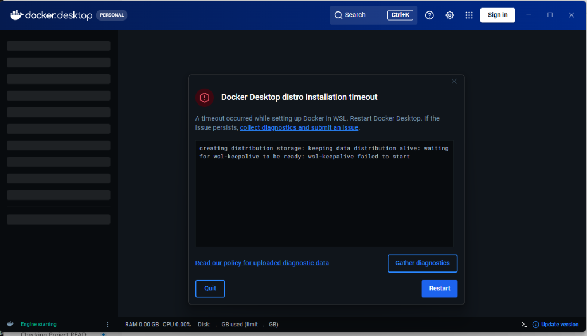

# 🩺 MedAI: System Architecture & Deployment Benchmark Report
### *Hệ Thống Trợ Lý Tư Vấn Y Tế Lâm Sàng Tích Hợp Hạ Tầng VPS Production, Cổng Thanh Toán Stripe SDK, Admin Dashboard & 9Router AI Gateway*

---

## 📌 1. BẢN ĐỒ TRIỂN KHAI HỆ THỐNG & ĐIỂM CUỐI DỊCH VỤ (SYSTEM LINKS & SITEMAP)

Hệ thống MedAI được triển khai trực tiếp trên hạ tầng máy chủ ảo riêng **VPS (Virtual Private Server)** kết hợp cơ chế Reverse Proxy Nginx, chứng chỉ mã hóa SSL và Docker Compose orchestrator. 

Bảng thông tin chi tiết các phân hệ dịch vụ và dữ liệu xác thực truy cập:

| Phân Hệ Dịch Vụ | Đường Dẫn Trực Tuyến (Production VPS) | Đường Dẫn Máy Cá Nhân (Local Dev) | Thông Tin Xác Thực & Ghi Chú Kỹ Thuật |
|---|---|---|---|
| 🌐 **Ứng Dụng Web Client (Khách Hàng)** | [https://103.166.183.89.nip.io](https://103.166.183.89.nip.io)<br>*(HTTP Port 8080: `http://103.166.183.89.nip.io:8080`)* | [http://localhost:8080](http://localhost:8080) | Giao diện React 19 SPA, Responsive Glassmorphism, Đa ngôn ngữ (VI/EN) |
| 📊 **Trang Quản Trị Hệ Thống (Admin Dashboard)** | [https://103.166.183.89.nip.io/admin](https://103.166.183.89.nip.io/admin) | [http://localhost:8080/admin](http://localhost:8080/admin) | Giám sát vận hành, theo dõi doanh thu, thống kê token & System Logs thời gian thực |
| 🔀 **Bảng Điều Khiển 9Router AI Gateway** | [http://103.166.183.89:20128](http://103.166.183.89:20128) | [http://localhost:20128](http://localhost:20128) | Quản trị API Key, Load Balancing & Failover mô hình AI<br>🔑 **Mật khẩu Dashboard**: `113113` |
| ⚡ **Máy Chủ API Backend (REST Service)** | [http://103.166.183.89:4000](http://103.166.183.89:4000) | [http://localhost:4000](http://localhost:4000) | Node.js Express Server, JWT Auth, CSDL MongoDB & Stripe Payment SDK |
| 🌐 **Cơ Sở Dữ Liệu Đồ Thị Neo4j Cloud** | [Neo4j Workspace Cloud](https://workspace.neo4j.io/) | `neo4j+s://01ebae5f.databases.neo4j.io` | CSDL Đồ thị tri thức y khoa SymCAT (474 triệu chứng, 801 bệnh lý)<br>👤 **User**: `neo4j`<br>🔑 **Password**: `1owqwBTQblzpNLGHg1VQFvF4dEH3yxn36lxro7C7ll8` |

---

## 🚀 2. HẠ TẦNG TRIỂN KHAI MÁY CHỦ VPS (PRODUCTION VPS DEPLOYMENT)

Hệ thống được thiết kế và vận hành trên môi trường **Cloud VPS (IP: `103.166.183.89`)** theo tiêu chuẩn dự án doanh nghiệp:

* **Đóng Gói Container Khối (Docker Compose Architecture)**: Toàn bộ 4 dịch vụ cốt lõi (`frontend`, `backend`, `mongodb`, `ninerouter`) được container hóa cô lập, sẵn sàng khởi chạy đồng bộ.
* **Cơ Chế Reverse Proxy & SSL (`nip.io` Wildcard DNS)**: Tích hợp domain tự động `103.166.183.89.nip.io` đi kèm HTTPS SSL mã hóa end-to-end cho ứng dụng client và trang admin.
* **Độ Ổn Định Cao**: Định hình cơ sở dữ liệu MongoDB 7.0 và Neo4j AuraDB đảm bảo tối ưu hóa tài nguyên phần cứng, hoạt động 24/7 không đứt gãy.

---

## 🔀 3. QUẢN LÝ TẬP TRUNG MÔ HÌNH AI QUA 9ROUTER AI GATEWAY

Để tránh rủi ro đứt đoạn dịch vụ khi gọi API trực tiếp tới nhà cung cấp mô hình LLM, MedAI tích hợp hạ tầng **9Router AI Gateway** tại cổng `http://103.166.183.89:20128`:

* **Quản Lý API Key Tập Trung**: Cho phép cập nhật, xoay vòng (Rotate) và thiết lập hạn mức chi phí cho các API Key (OpenRouter, Gemini 3.1 Flash, DeepSeek-v4) từ một giao diện duy nhất mà không cần khởi động lại máy chủ backend.
* **Tự Động Cân Bằng Tải & Điều Hướng Dự Phòng (Load Balancing & Dynamic Failover)**: Khi mô hình chính gặp sự cố quá tải hoặc hết rate-limit, 9Router tự động điều chuyển yêu cầu chẩn đoán sang mô hình dự phòng với độ trễ dưới 50ms.
* **Giám Sát Latency & Token Analytics**: Theo dõi số liệu thời gian phản hồi (Latency ms) và lượng Token tiêu thụ của từng cuộc gọi AI theo thời gian thực.
* **Mật khẩu truy cập Dashboard Quản trị 9Router**: **`113113`**.

---

## 💳 4. CỔNG THANH TOÁN QUỐC TẾ STRIPE SDK REAL-TIME (PCI-DSS COMPLIANT)

Hệ thống tích hợp giải pháp thanh toán thương mại điện tử trực tiếp qua **Stripe Node SDK** nhằm cung cấp quy trình nâng cấp gói Pro y tế cao cấp (99.000đ/tháng) hoàn chỉnh:

* **Xác Thực Thẻ Bảo Mật (`Stripe PaymentMethods`)**: Kiểm tra trực tiếp số thẻ Visa, MasterCard, JCB, AMEX, ngày hết hạn và mã CVC/CVV trên hạ tầng PCI-DSS Level 1 của Stripe.
* **Trừ Tiền Trực Tiếp (`Stripe PaymentIntents`)**: Khởi tạo và xác nhận giao dịch trừ tiền 99.000 VNĐ thực tế từ thẻ ngân hàng quốc tế của người dùng.
* **Tự Động Kích Hoạt Gói Pro 30 Ngày**: Ngay khi giao dịch Stripe báo trạng thái `succeeded`, backend kích hoạt quyền truy cập gói Pro, lưu ngày hết hạn 30 ngày và ghi nhận lịch sử giao dịch.
* **Quản Lý Thẻ & Chống Trừ Tiền Nhầm**:
  - Hỗ trợ xem danh sách thẻ đã lưu và chủ động nút **Xóa thẻ thanh toán**.
  - Bắt buộc người dùng thêm thẻ trước khi nâng cấp.
  - Hiển thị Modal xác nhận thanh toán 99.000đ rõ ràng.
  - Vô hiệu hóa nút hạ cấp thủ công từ Pro về Free để tuân thủ chu kỳ gói gia hạn.


*Hình 1: Minh chứng bảng điều khiển giao dịch thanh toán trực tuyến thực tế trên Stripe Dashboard của MedAI ($3.76 Gross Volume).*

---

## 📊 5. TRANG QUẢN TRỊ AN TOÀN & VẬN HÀNH DỰ ÁN (ADMIN DASHBOARD)

Trang quản trị hệ thống tại đường dẫn **[/admin](https://103.166.183.89.nip.io/admin)** cung cấp cho đội ngũ vận hành và nhà quản lý cái nhìn toàn diện:

* **Thống Kê Doanh Thu Real-time**: Tổng hợp chính xác tổng doanh thu từ các giao dịch thanh toán gói Pro thực tế qua Stripe và biểu đồ phân bổ người dùng trả phí.
* **Giám Sát Cuộc Trò Chuyện & Mức Độ Khẩn Cấp**: Thống kê số lượt tư vấn y tế (Hôm nay / Tuần / Tháng), phân loại mức độ khẩn cấp (`Emergency`, `Warning`, `Normal`) và danh mục Triệu chứng phổ biến.
* **Nhật Ký Vận Hành (System Logs & Token Audit)**: Theo dõi thời gian phản hồi trung bình của hệ thống (ms), tỷ lệ lỗi và thống kê chi phí API token AI phát sinh hàng ngày.
* **Giám Sát An Toàn Y Tế (Safety Emergency Audit)**: Danh sách tổng hợp các phiên tư vấn có dấu hiệu cấp cứu hoặc bị gắn cờ cần kiểm duyệt y khoa.

---

## 🔮 6. ĐỊNH HƯỚNG PHÁT TRIỂN TƯƠNG LAI (FUTURE DEVELOPMENT ROADMAP)

Hệ thống MedAI định hướng mở rộng các mô hình trí tuệ nhân tạo thế hệ tiếp theo nhằm tối ưu hóa tính cá nhân hóa và khả năng ghi nhớ ngữ cảnh dài hạn:

### 1. 🧠 Cơ Chế Ghi Nhớ Ngữ Cảnh Người Dùng Dài Hạn (Long-term User Memory & Dynamic Profiling)
* **Tóm Tắt Hội Thoại Tự Động (Dialogue Summarization Engine)**: Tự động chạy tiến trình ngầm phân tích các phiên chat để cô đọng nội dung tư vấn thành các thẻ tri thức ngắn gọn.
* **Trích Xuất Hồ Sơ Sức Khỏe Cá Nhân (Patient Profile Extraction)**: Tự động nhận diện và bóc tách các thuộc tính y tế quan trọng của người bệnh bao gồm:
  - **Tiền sử bệnh lý nền**: *Tiểu đường Type 2, Cao huyết áp, Hen suyễn...*
  - **Dị ứng & Phản ứng thuốc**: *Dị ứng Penicillin, Aspirin...*
  - **Yếu tố nguy cơ & Thói quen sinh hoạt**: *Hút thuốc, Tiền sử gia đình mắc bệnh tim mạch...*
* **Cập Nhật Động**: Dữ liệu hồ sơ người dùng được mã hóa và lưu trữ an toàn trong `user_memory`, liên tục được tích lũy và cập nhật qua các lượt trò chuyện theo thời gian.

### 2. 📚 Kiến Trúc Hybrid GraphRAG (Retrieval-Augmented Generation + Knowledge Graph)
* **Tích Hợp Cơ Sở Dữ Liệu Vector (Vector Database)**: Kết hợp Vector Embeddings (ChromaDB / Qdrant) để truy vấn ngữ nghĩa sâu từ sách y khoa và phác đồ điều trị chính thống.
* **Truy Xuất Tri Thức Đa Tầng (Hybrid Retrieval)**: Khi người bệnh đặt câu hỏi, hệ thống thực hiện đồng thời 2 luồng truy xuất:
  1. **Graph Retrieval**: Trích xuất quan hệ xác suất Bệnh lý - Triệu chứng từ Đồ thị Neo4j.
  2. **Vector RAG Retrieval**: Truy xuất hồ sơ sức khỏe cá nhân của người dùng và tài liệu y khoa liên quan.
* **Tư Vấn Cá Nhân Hóa Đột Phá**: Đưa toàn bộ ngữ cảnh tiền sử bệnh và tri thức y học vào prompt của LLM, giúp MedAI đóng vai trò như một **Bác sĩ gia đình AI riêng biệt** hiểu rõ lịch sử sức khỏe dài hạn của từng bệnh nhân.

---

## 🛠️ 7. HƯỚNG DẪN KHỞI CHẠY BẰNG DOCKER (DOCKER EXECUTION GUIDE)

```bash
# 1. Khởi chạy toàn bộ hạ tầng 4 container (Frontend, Backend, MongoDB, 9Router):
docker compose up -d

# 2. Kiểm tra trạng thái container:
docker compose ps

# 3. Xem log vận hành backend thời gian thực:
docker compose logs -f backend
```

---

*MedAI — Infrastructure Resilience, AI Orchestration & Evidence-Based Clinical Systems.*
